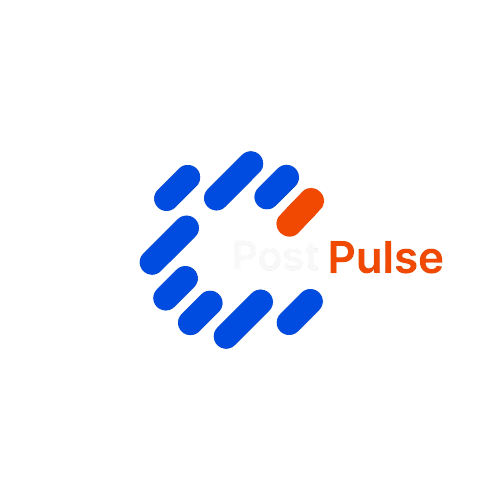

# PostPulse



**PostPulse** is a creative agency website that specializes in crafting standout social media content for E-commerce, Real Estate, Food & Beverage, and Travel brands. Our content is designed to boost engagement, grow your audience, and drive results.

## 🚀 Live Demo

Visit our website: [PostPulse Agency](https://mxd0-0.github.io/PostPulse/)

## 📋 Table of Contents

- [About](#about)
- [Features](#features)
- [Technologies Used](#technologies-used)
- [Installation](#installation)
- [Development](#development)
- [Build Process](#build-process)
- [Project Structure](#project-structure)
- [Services](#services)
- [Industries We Serve](#industries-we-serve)
- [Contributing](#contributing)
- [Contact](#contact)
- [License](#license)

## 🎯 About

PostPulse is a modern, responsive landing page for a social media content creation agency. The website showcases our services, testimonials, and provides comprehensive information about our offerings. We create content that connects with your audience and drives action across multiple social media platforms.

### Key Highlights:
- **Industry-Smart Design**: Content tailored to specific industries
- **Expert Creativity**: Strategy and style combined by professional designers
- **Client Control**: You set the vision, we bring it to life
- **Quick Turnaround**: High-quality content delivered fast

## ✨ Features

- **Responsive Design**: Optimized for all devices and screen sizes
- **Modern UI/UX**: Clean, professional design with smooth animations
- **Multi-language Support**: Content available in English and Arabic
- **Interactive Elements**: 
  - Animated sections with AOS (Animate On Scroll)
  - Swiper sliders for testimonials
  - Smooth scrolling navigation
  - Hover effects and transitions
- **SEO Optimized**: Meta tags and structured content
- **Fast Loading**: Optimized images and lazy loading
- **Contact Forms**: Easy ways for potential clients to reach out

## 🛠 Technologies Used

- **HTML5**: Semantic markup and accessibility
- **CSS3**: Modern styling with custom properties
- **SASS/SCSS**: Advanced CSS preprocessing
- **Bootstrap 5**: Responsive grid system and components
- **JavaScript**: Interactive functionality
- **AOS (Animate On Scroll)**: Scroll-triggered animations
- **Swiper.js**: Touch-enabled slider/carousel
- **Tabler Icons**: Professional icon set
- **Vanilla LazyLoad**: Image lazy loading for performance

## 📦 Installation

1. **Clone the repository**
   ```bash
   git clone https://github.com/mxd0-0/PostPulse.git
   cd PostPulse
   ```

2. **Install dependencies**
   ```bash
   npm install
   ```

3. **Build the project**
   ```bash
   npm run compile:sass
   ```

4. **Open in browser**
   ```bash
   # Open index.html in your preferred browser
   # Or use a local server like Live Server in VS Code
   ```

## 🔧 Development

### Prerequisites
- Node.js (v14 or higher)
- npm or yarn package manager

### Development Workflow

1. **Start development with SASS watching**
   ```bash
   npm run watch:sass
   ```
   This will automatically compile SASS files when you make changes.

2. **Manual SASS compilation**
   ```bash
   npm run compile:sass
   ```

3. **File Structure for Development**
   - Edit SASS files in `assets/scss/`
   - Main styles: `assets/scss/styles.scss`
   - Reset styles: `assets/scss/reset.scss`
   - Variables: `assets/scss/reset-variables.scss`

### Available Scripts

- `npm run compile:sass` - Compile SASS to CSS
- `npm run watch:sass` - Watch SASS files and compile on changes
- `npm test` - Run tests (currently not implemented)

## 🏗 Build Process

The build process uses SASS to compile stylesheets:

1. **SASS Compilation**: 
   - `assets/scss/reset.scss` → `assets/css/reset.main.css`
   - `assets/scss/styles.scss` → `assets/css/styles.main.css`

2. **Dependencies**:
   - Bootstrap framework
   - Tabler Icons
   - AOS animations
   - Hover.css effects
   - International Tel Input

3. **Output Files**:
   - Compiled CSS files in `assets/css/`
   - Minified versions available
   - Source maps for debugging

## 📁 Project Structure

```
PostPulse/
├── assets/
│   ├── css/              # Compiled CSS files
│   ├── js/               # JavaScript files
│   ├── plugins/          # Third-party plugins
│   └── scss/            # SASS source files
│       ├── bootstrap/   # Bootstrap framework
│       ├── tabler-icons/ # Icon fonts
│       ├── reset.scss   # CSS reset
│       ├── styles.scss  # Main styles
│       └── reset-variables.scss # SASS variables
├── node_modules/        # Dependencies
├── .vscode/            # VS Code configuration
├── .idea/              # IDE configuration
├── index.html          # Main HTML file
├── style.css           # Additional custom styles
├── package.json        # NPM configuration
├── banner.png          # Hero banner image
├── post.png            # Logo image
├── logo_without_logo.png # Alternative logo
├── user.png            # User avatar placeholder
└── README.md           # This file
```

## 💼 Services

### What We Offer:
- **Social Media Content Creation**: Posts, carousels, and reels
- **Brand Strategy**: Consistent visual identity across platforms
- **Content Planning**: Strategic content calendars
- **Quality Assurance**: Every post is double-checked
- **Quick Turnaround**: Fast delivery without compromising quality

### Our Process:
1. **Discovery**: Understanding your brand and audience
2. **Strategy**: Developing content strategy aligned with goals
3. **Creation**: Designing engaging visual content
4. **Review**: Quality assurance and client feedback
5. **Delivery**: Final content ready for publishing

## 🏢 Industries We Serve

- **E-commerce**: Product showcases and promotional content
- **Travel & Tourism**: Destination highlights and travel inspiration
- **Real Estate**: Property showcases and market insights
- **Food & Beverage**: Menu items and culinary experiences
- **General Business**: Professional content for any industry

## 🤝 Contributing

We welcome contributions to improve the PostPulse website. Here's how you can help:

1. **Fork the repository**
2. **Create a feature branch**
   ```bash
   git checkout -b feature/your-feature-name
   ```
3. **Make your changes**
4. **Test your changes**
5. **Commit your changes**
   ```bash
   git commit -m "Add: your feature description"
   ```
6. **Push to the branch**
   ```bash
   git push origin feature/your-feature-name
   ```
7. **Open a Pull Request**

### Development Guidelines:
- Follow existing code style and structure
- Test on multiple browsers and devices
- Optimize images and assets
- Update documentation for significant changes
- Use semantic HTML and accessible design

## 📞 Contact

**PostPulse Agency**

- **Instagram**: [@postpulse.agency](https://www.instagram.com/postpulse.agency/)
- **Website**: [PostPulse.agency](https://postpulse.agency)
- **Email**: Contact us through our website form

### Get Started:
1. **Free Consultation**: Discuss your content needs
2. **Free Samples**: Get 2 free social media posts
3. **Custom Solutions**: Tailored content strategies
4. **Ongoing Support**: Continuous content creation and optimization

## 🎨 Design Credits

- **Template Base**: Nayzak Design Templates
- **Icons**: Tabler Icons
- **Animations**: AOS (Animate On Scroll)
- **Slider**: Swiper.js
- **Framework**: Bootstrap 5

## 📝 License

This project is proprietary and confidential. All rights reserved by PostPulse Agency.

---

**Ready to boost your social media presence?** Contact us today for your free consultation and sample content!


